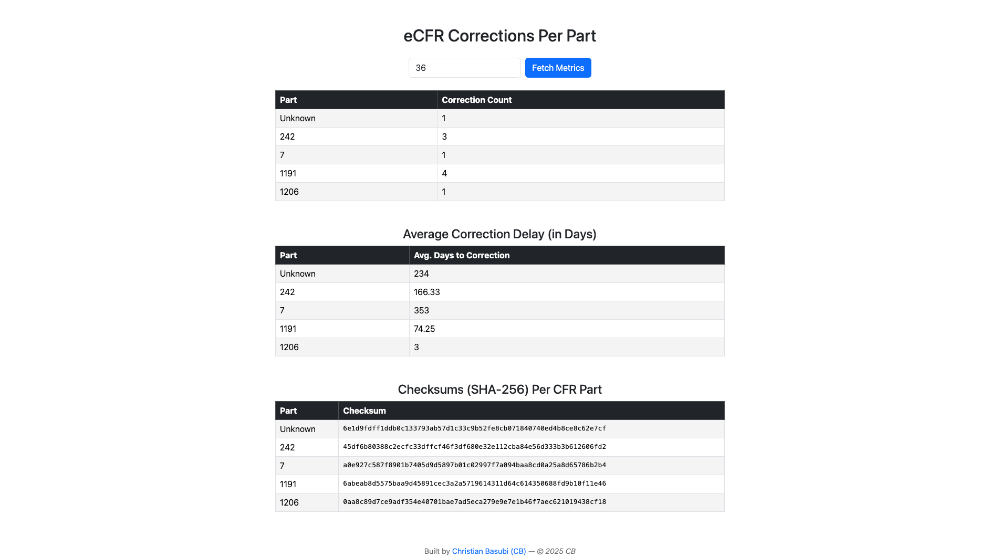

# eCFR Analyzer by Christian Basubi 

Welcome to the eCFR Analyzer! 👋 
This is a lightweight, developer-friendly web app designed to help analyze U.S. Federal regulations using the eCFR public API. It pulls correction data for any CFR Title, stores it server-side, and provides digestible metrics through a clean and responsive web interface.

> ⚖️ Because 200,000+ pages of government rules shouldn’t be scary — not if you’ve got good code.

---

## 🚀 What This App Does

- Connects to the **eCFR API**
- Downloads and saves **correction data by Title number**
- Stores data locally under `/Data`, can be done on a server as well.
- Provides **real-time analysis** via Razor Pages UI
- All data and metrics are computed server-side in C# (.NET 9)

---

## 📊 Metrics Displayed

Once a title is selected, you’ll see:

1. **Corrections per CFR Part**  
   → How many times each part has been corrected

2. **Average Correction Delay**  
   → On average, how long (in days) did it take to correct mistakes in each part

3. **Checksum per Part (SHA-256)**  
   → A unique fingerprint of correction data, to detect changes over time or between versions

---

## 👀 How to Use It

### Prerequisites

- .NET 9 SDK (installed via Homebrew or official installer)
- macOS or Windows
- Visual Studio Code or your favorite IDE

### Getting Started

1. Clone the project or unzip the folder
2. Open a terminal inside the root folder
3. Run:

```bash
dotnet restore
dotnet run
================
When done with that, Opem your browser and visit http://localhost:<your-port-number>/ui

! Be sure to replace <your-port-number> with the actual port shown in your terminal output when the app starts.

Note: An AI agent that CB built helped with the wording and structure of this README.

Project Structure: 

/Controllers
/Pages
  /Ecfr
/Models
/Data         <-- downloaded JSON files here
/wwwroot      
EcfrService.cs
Program.cs
README.md

Built With:

ASP.NET Core (.NET 9)
Razor Pages
Bootstrap 5
SHA-256 hashing
eCFR REST API

## 📸 Screenshot

Here's what the UI looks like when analyzing corrections for a CFR Title:

